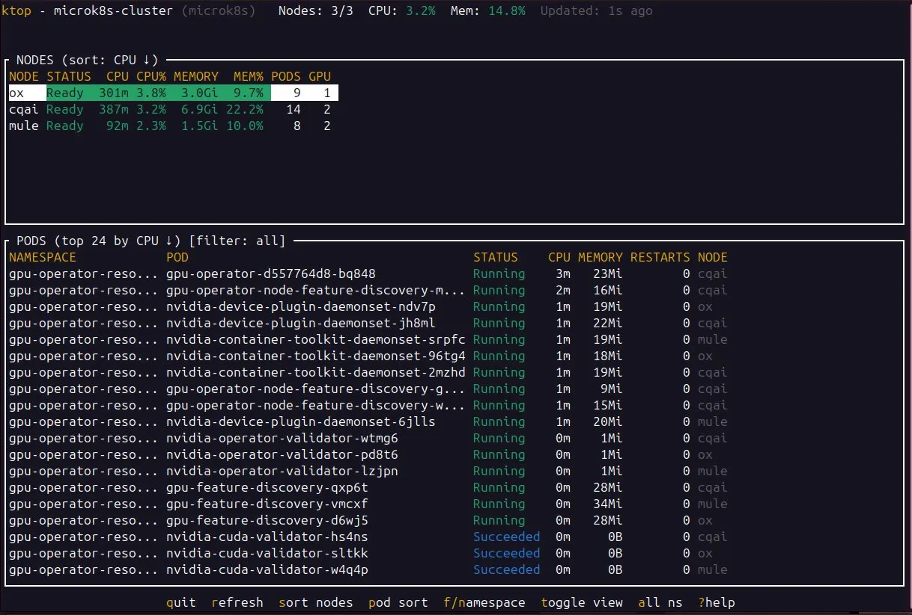

<p align="center">
  <h1 align="center">ktop</h1>
  <p align="center">
    <strong>Real-time Kubernetes cluster monitoring in your terminal</strong>
  </p>
  <p align="center">
    <a href="#installation">Installation</a> •
    <a href="#usage">Usage</a> •
    <a href="#configuration">Configuration</a> •
    <a href="#contributing">Contributing</a>
  </p>
</p>

---

**ktop** is a lightweight terminal UI (TUI) for monitoring Kubernetes clusters, inspired by [htop](https://htop.dev/) and [nvtop](https://github.com/Syllo/nvtop). Get instant visibility into node and pod resource usage with color-coded metrics and interactive controls.



## ✨ Features

- **Real-time metrics** — CPU, memory, disk, and GPU usage updated every 2 seconds
- **Cluster overview** — Total resources, node count, and aggregate utilization at a glance
- **Node monitoring** — Per-node CPU, memory, pod count, and GPU availability
- **Pod monitoring** — Sortable list of pods with resource consumption and restart counts
- **GPU support** — Automatic detection of NVIDIA GPUs via device plugin labels
- **Interactive controls** — Sort, filter, and navigate with keyboard shortcuts
- **Color-coded thresholds** — Green (healthy), yellow (warning), red (critical)
- **Single binary** — No dependencies, just drop it on your cluster and run
- **Cross-platform** — Linux, macOS, and Windows builds available

## 📋 Requirements

- Kubernetes cluster with [metrics-server](https://github.com/kubernetes-sigs/metrics-server) installed
- Valid kubeconfig file (`~/.kube/config` or `KUBECONFIG` env var)
- Network access to the Kubernetes API server

### Installing metrics-server

<details>
<summary><strong>Standard Kubernetes</strong></summary>

```bash
kubectl apply -f https://github.com/kubernetes-sigs/metrics-server/releases/latest/download/components.yaml
```
</details>

<details>
<summary><strong>MicroK8s</strong></summary>

```bash
microk8s enable metrics-server
```
</details>

<details>
<summary><strong>k3s</strong></summary>

metrics-server is included by default.
</details>

## 📦 Installation

### Download Pre-built Binary

Download the latest release for your platform from the [Releases](https://github.com/nlaak/ktop/releases) page.

```bash
# Linux (amd64)
curl -LO https://github.com/nlaak/ktop/releases/latest/download/ktop-linux-amd64
chmod +x ktop-linux-amd64
sudo mv ktop-linux-amd64 /usr/local/bin/ktop

# macOS (Apple Silicon)
curl -LO https://github.com/nlaak/ktop/releases/latest/download/ktop-darwin-arm64
chmod +x ktop-darwin-arm64
sudo mv ktop-darwin-arm64 /usr/local/bin/ktop
```

### Build from Source

Requires Go 1.22 or later.

```bash
git clone https://github.com/nlaak/ktop.git
cd ktop
make build
sudo mv ktop /usr/local/bin/
```

## 🚀 Usage

```bash
# Basic usage (uses default kubeconfig)
ktop

# Specify kubeconfig file
ktop -kubeconfig /path/to/kubeconfig

# Use specific context
ktop -context my-cluster

# Faster refresh rate
ktop -refresh-interval 1s

# Show system namespaces (kube-system, etc.)
ktop -all-namespaces

# Show more pods
ktop -top-pods 50
```

### Command-line Flags

| Flag | Default | Description |
|------|---------|-------------|
| `-kubeconfig` | `~/.kube/config` | Path to kubeconfig file |
| `-context` | current | Kubernetes context to use |
| `-refresh-interval` | `2s` | Metrics refresh interval |
| `-timeout` | `10s` | API call timeout |
| `-top-pods` | `30` | Number of top pods to display |
| `-all-namespaces` | `false` | Include system namespaces |
| `-version` | — | Show version |
| `-help` | — | Show help |

### Keyboard Controls

| Key | Action |
|-----|--------|
| `q` | Quit |
| `r` | Force refresh |
| `s` | Sort nodes (cycle: name → CPU → memory → status → pods) |
| `p` | Sort pods (cycle: namespace → name → CPU → memory) |
| `f` / `n` | Cycle namespace filter |
| `t` | Toggle view mode (split / nodes / pods) |
| `a` | Toggle system namespaces visibility |
| `Tab` | Switch focus between nodes and pods |
| `?` | Show help |
| `Esc` | Clear namespace filter |
| `↑` / `↓` | Navigate selection |

### Color Coding

| Level | Color | CPU/Memory Threshold |
|-------|-------|---------------------|
| Healthy | 🟢 Green | 0–50% |
| Warning | 🟡 Yellow | 50–80% |
| Critical | 🔴 Red | 80%+ |

## ⚙️ Configuration

### Customizing the Makefile

The project uses a Makefile for building and deployment. You can customize these variables:

#### Build Variables

```makefile
# Version format: YYYYMMDD.HHMM-{alpha|beta|prod}
# Override release type when building:
make build-linux RELEASE=prod
make build-linux RELEASE=beta
make build-all RELEASE=prod
```

#### Deploy Variables

Configure deployment to your cluster master or any remote host:

```makefile
# Default values (edit in Makefile or override on command line)
DEPLOY_HOST ?= 192.168.1.76
DEPLOY_USER ?= andrew
DEPLOY_PATH ?= /usr/local/bin/ktop
```

**Override on command line:**

```bash
# Deploy to a different host
make deploy DEPLOY_HOST=10.0.0.50 DEPLOY_USER=admin

# Deploy to user's home bin (no sudo required)
make deploy-user DEPLOY_HOST=k8s-master DEPLOY_USER=ops
```

### Build Targets

```bash
make                  # Build for current platform
make build-linux      # Build for Linux amd64 → bin/linux-amd64/ktop
make build-linux-arm  # Build for Linux arm64 → bin/linux-arm64/ktop  
make build-darwin     # Build for macOS amd64 → bin/darwin-amd64/ktop
make build-darwin-arm # Build for macOS arm64 → bin/darwin-arm64/ktop
make build-windows    # Build for Windows    → bin/windows-amd64/ktop.exe
make build-all        # Build all platforms
make release          # Build all platforms as production release
make deploy           # Build and deploy to DEPLOY_HOST
make clean            # Remove build artifacts
make help             # Show all available targets
```

## 🏗️ Project Structure

```
ktop/
├── cmd/ktop/          # Application entry point
│   └── main.go
├── internal/
│   ├── config/        # CLI flags and configuration
│   ├── k8s/           # Kubernetes client wrapper
│   ├── metrics/       # Metrics collection and formatting
│   ├── models/        # Data structures
│   └── ui/            # Terminal UI (tview)
├── bin/               # Build output (gitignored)
│   ├── linux-amd64/
│   ├── linux-arm64/
│   ├── darwin-amd64/
│   ├── darwin-arm64/
│   └── windows-amd64/
├── docs/              # Documentation and screenshots
├── Makefile
├── go.mod
└── README.md
```

## 🤝 Contributing

Contributions are welcome! Please feel free to submit a Pull Request.

1. Fork the repository
2. Create your feature branch (`git checkout -b feature/amazing-feature`)
3. Commit your changes (`git commit -m 'Add amazing feature'`)
4. Push to the branch (`git push origin feature/amazing-feature`)
5. Open a Pull Request

### Development

```bash
# Run locally without building
make run

# Run with development flags
make run-dev

# Format code
make fmt

# Run linter
make lint

# Run tests
make test
```

## 📄 License

This project is licensed under the MIT License — see the [LICENSE](LICENSE) file for details.

## 🙏 Acknowledgments

- [tview](https://github.com/rivo/tview) — Terminal UI library
- [client-go](https://github.com/kubernetes/client-go) — Official Kubernetes Go client
- Inspired by [htop](https://htop.dev/), [nvtop](https://github.com/Syllo/nvtop), and [k9s](https://k9scli.io/)

---

<p align="center">
  Made with ☕ by <a href="https://nlaak.com">Nlaak Studios</a>
</p>